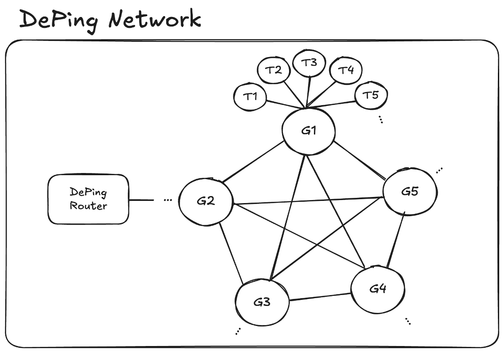
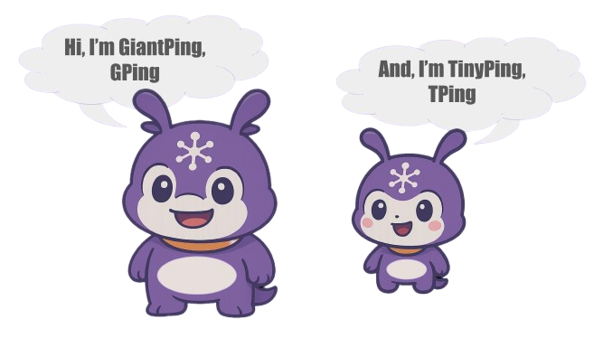
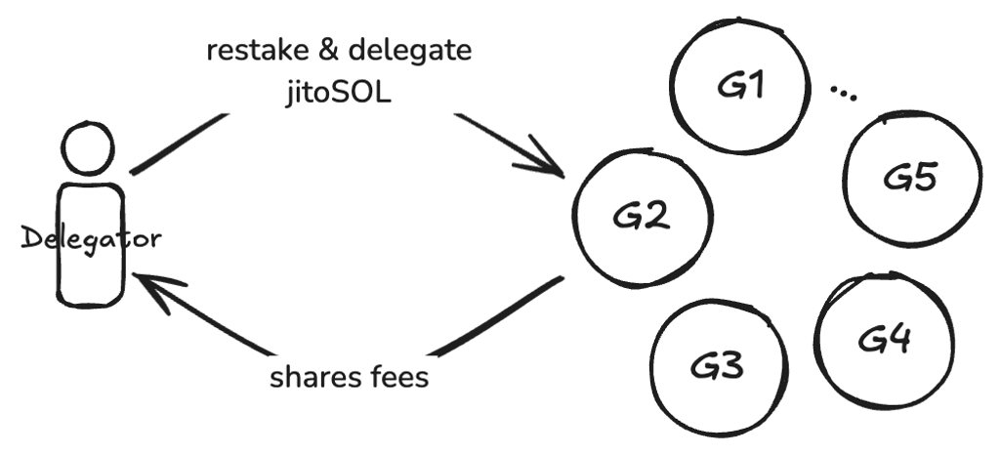
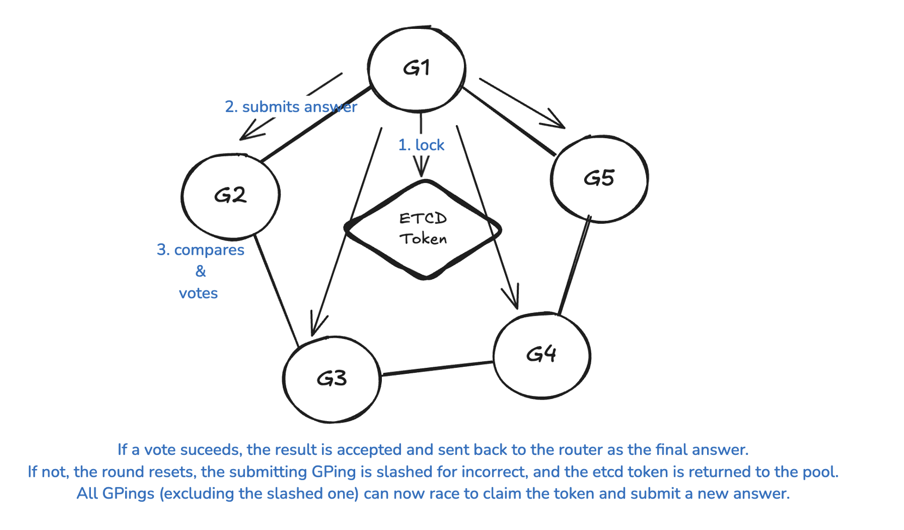
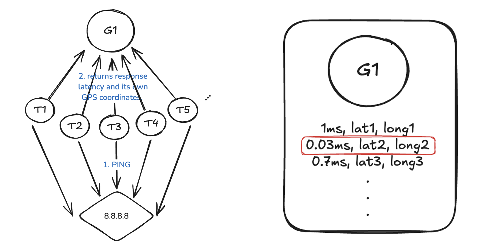

# DePing

## 🌐 Overview

DePing is a decentralized IP geolocation AVS (Address Verification System) built on user-restaked LSTs (Liquid Staking Tokens) such as **jitoSOL**. The protocol aims to power the physical internet layer by providing a decentralized, verifiable IP infrastructure protocol designed for DePIN (Decentralized Physical Infrastructure Network) & DID (Decentralized Identity).

### 🔑 Key Features
- **Decentralized Probe Network**: Probes (TPing) verify IP location data in real-time and are rewarded or slashed based on accuracy.
- **Restaking Layer**: Built on an LST-based restaking mechanism, aligning economic incentives to ensure honest location reporting.
- **Permissionless Participation**: Anyone can restake jitoSOL and contribute to the network.
- **Real Economic Incentives**: Fees paid in jitoSOL are distributed among stakeholders.
- **Compatibility**: Designed to integrate with decentralized VPNs, geofenced dApps, and node provenance systems.

---

## 🏛 Architecture

### 📦 Components
- **GPing (Staking Pool)**: A staked probe node that coordinates with TPing probes to verify IP geolocation, aggregate response data, and participate in a decentralized voting process.
- **TPing (Staker)**: A lightweight probe that performs network pings to target IP addresses and reports response latency and GPS coordinates.

### 🔄 Restaking Model
To become an active TPing, one must restake jitoSOL into a GPing and continuously submit reliable measurement data. The process includes:
- **TPing**: Acts as a staker, providing restaked jitoSOL to a GPing.
- **GPing**: Acts as a staking pool, aggregating TPings' geolocation data for verification.
- **Validation**: Only TPings with restaked positions are considered valid contributors in the location validation process.

---

## 💰 Economic Flow

### 📈 Revenue Source
- All query fees are paid in **jitoSOL** (or other LSTs).
- Optional MEV rewards from restaked jitoSOL can be captured to support sustainability.
- A small protocol fee (e.g., 5%) is taken from each query to fund development, operations, and security bounties.

### 💸 Reward Distribution
- Remaining fees are split per request:
  - **50%** to the GPing node that submitted the accepted location.
  - **50%** shared equally among all voting GPings that passed validation.
- Delegators and TPings earn a share of rewards from the GPings they support through restaking.

---

## 🔍 Use Cases
- **Decentralized VPNs**: Verify peer relay locations to prevent routing fraud.
- **DID Protocols**: Provide location-based identity components.
- **Validator Audits**: Check geographic centralization of PoS infrastructure.
- **Geo-fenced dApps**: Allow or restrict access based on verified IP zones.
- **Node Marketplaces**: Score and reward reliable infrastructure based on location uptime.

---

## 🌟 Competitive Edge
- **Solana-native AVS with real-world IP utility**.
- **Fills the AVS gap on Solana** by bringing EigenLayer-style restaking utility to the ecosystem.
- **Leverages jitoSOL** for full restaking utility.
- **Expands the Solana LST ecosystem** by driving economic activity and adoption.
- **Composable with DeFi and restaking protocols**, integrating seamlessly with Jito, Sanctum, and other infrastructure layers.
- **Natural fit for Sanctum**, unlocking potential for Infinity-powered delegation and liquidity routing.
- **Ecosystem Composability**: Integrates with professional node operators, Fragmetric, and restaking flows for optimal performance.

---

## 📄 License
This project is licensed under the MIT License.

---

# DePing (한국어)

## 🌐 개요

DePing은 **jitoSOL**과 같은 사용자 재스테이킹 LST(Liquid Staking Tokens)를 기반으로 구축된 탈중앙화 IP 지리적 위치 AVS(주소 확인 시스템)입니다. 이 프로토콜은 DePIN(탈중앙화 물리 인프라 네트워크) 및 DID(탈중앙화 신원 증명)를 위해 설계된 탈중앙화되고 검증 가능한 IP 인프라 프로토콜을 제공하여 물리적 인터넷 레이어를 지원하는 것을 목표로 합니다.

### 🔑 주요 기능
- **탈중앙화 프로브 네트워크**: 프로브(TPing)는 실시간으로 IP 위치 데이터를 검증하고 정확도에 따라 보상을 받거나 슬래싱됩니다.
- **재스테이킹 레이어**: LST 기반 재스테이킹 메커니즘을 통해 정직한 위치 보고를 보장하는 경제적 인센티브를 조정합니다.
- **무허가 참여**: 누구나 jitoSOL을 재스테이킹하고 네트워크에 기여할 수 있습니다.
- **실질적 경제 인센티브**: jitoSOL로 지불되는 수수료가 이해관계자들에게 분배됩니다.
- **호환성**: 탈중앙화 VPN, 지역 제한 dApp 및 노드 출처 시스템과 통합되도록 설계되었습니다.

---

## 🏛 아키텍처

### 📦 구성 요소
- **GPing (스테이킹 풀)**: TPing 프로브와 협력하여 IP 지리적 위치를 검증하고, 응답 데이터를 집계하며, 탈중앙화 투표 과정에 참여하는 스테이킹된 프로브 노드입니다.
- **TPing (스테이커)**: 대상 IP 주소에 네트워크 핑을 수행하고 응답 지연 시간과 GPS 좌표를 보고하는 경량 프로브입니다.

### 🔄 재스테이킹 모델
활성 TPing이 되려면 jitoSOL을 GPing에 재스테이킹하고 지속적으로 신뢰할 수 있는 측정 데이터를 제출해야 합니다. 이 과정은 다음을 포함합니다:
- **TPing**: 스테이커 역할을 하며, 재스테이킹된 jitoSOL을 GPing에 제공합니다.
- **GPing**: 스테이킹 풀 역할을 하며, 검증을 위해 TPing의 지리적 위치 데이터를 집계합니다.
- **검증**: 재스테이킹된 포지션을 가진 TPing만이 위치 검증 과정에서 유효한 기여자로 간주됩니다.

---

## 💰 경제적 흐름

### 📈 수익 출처
- 모든 쿼리 수수료는 **jitoSOL**(또는 다른 LST)로 지불됩니다.
- 재스테이킹된 jitoSOL의 선택적 MEV 보상을 통해 지속 가능성을 지원할 수 있습니다.
- 각 쿼리에서 작은 프로토콜 수수료(예: 5%)가 개발, 운영 및 보안 바운티에 사용됩니다.

### 💸 보상 분배
- 남은 수수료는 요청당 다음과 같이 분할됩니다:
  - **50%**는 승인된 위치를 제출한 GPing 노드에게 지급됩니다.
  - **50%**는 검증을 통과한 모든 투표 GPing 간에 균등하게 공유됩니다.
- 위임자와 TPing은 재스테이킹을 통해 지원하는 GPing으로부터 보상의 일부를 얻습니다.

---

## 🔍 사용 사례
- **탈중앙화 VPN**: 라우팅 사기를 방지하기 위해 피어 릴레이 위치를 확인합니다.
- **DID 프로토콜**: 위치 기반 신원 요소를 제공합니다.
- **검증자 감사**: PoS 인프라의 지리적 중앙화를 확인합니다.
- **지역 제한 dApp**: 검증된 IP 구역에 따라 접근을 허용하거나 제한합니다.
- **노드 마켓플레이스**: 위치 가용성에 따라 신뢰할 수 있는 인프라를 평가하고 보상합니다.

---

## 🌟 경쟁 우위
- **실제 IP 유틸리티를 갖춘 Solana 네이티브 AVS**.
- **EigenLayer 스타일의 재스테이킹 유틸리티를 생태계에 도입하여 Solana의 AVS 격차를 메웁니다**.
- **jitoSOL**을 활용하여 완전한 재스테이킹 유틸리티를 제공합니다.
- **경제적 활동과 채택을 촉진하여 Solana LST 생태계를 확장합니다**.
- **DeFi 및 재스테이킹 프로토콜과 조합 가능**, Jito, Sanctum 및 기타 인프라 레이어와 원활하게
통합됩니다.
- **Sanctum과 자연스럽게 어울려** Infinity 기반 위임 및 유동성 라우팅의 잠재력을 활용합니다.
- **생태계 구성 가능성**: 최적의 성능을 위해 전문 노드 운영자, Fragmetric 및 재스테이킹 흐름과 통합됩니다.

---

## 📄 라이선스
이 프로젝트는 MIT 라이선스에 따라 라이선스가 부여됩니다.